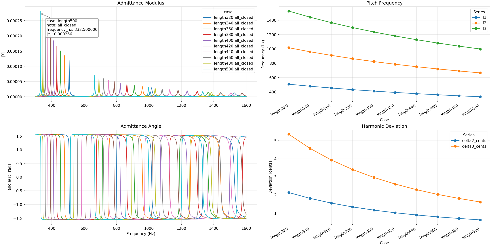
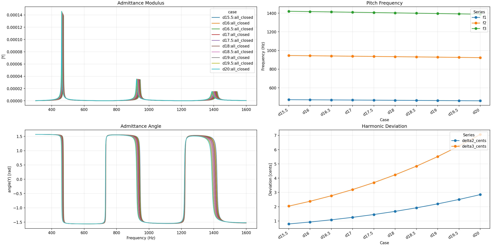
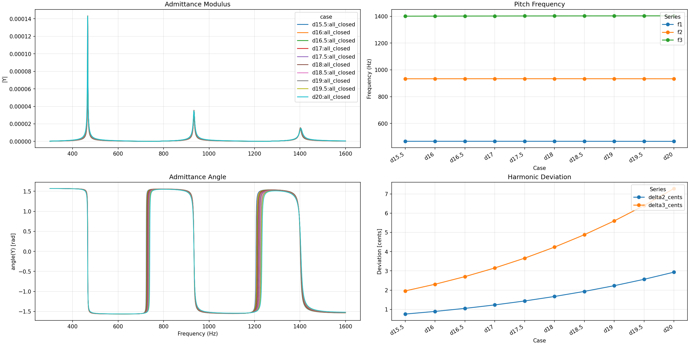
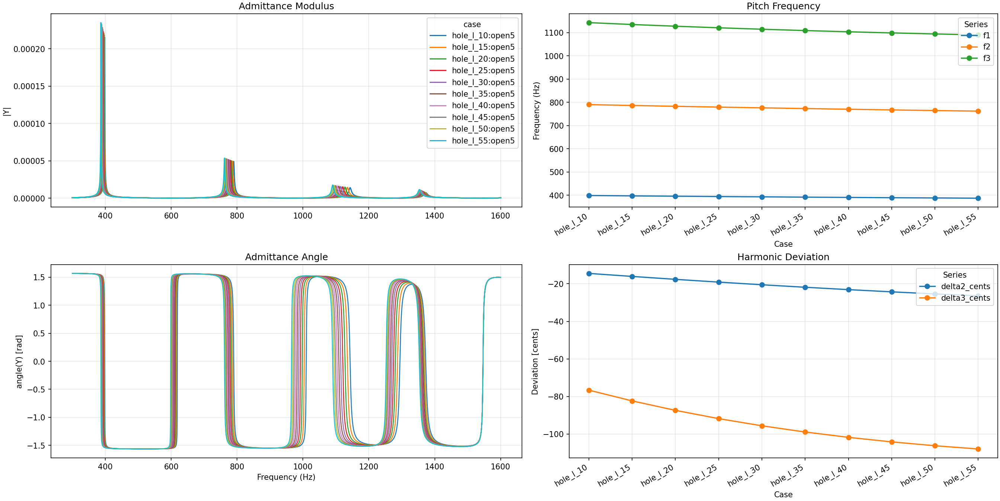
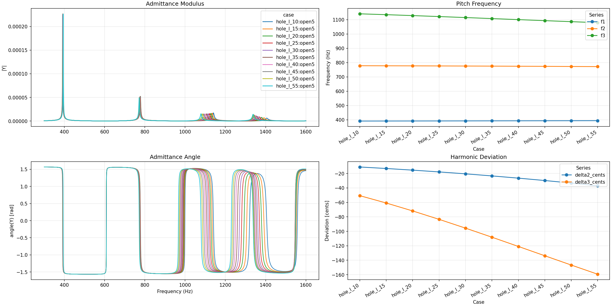
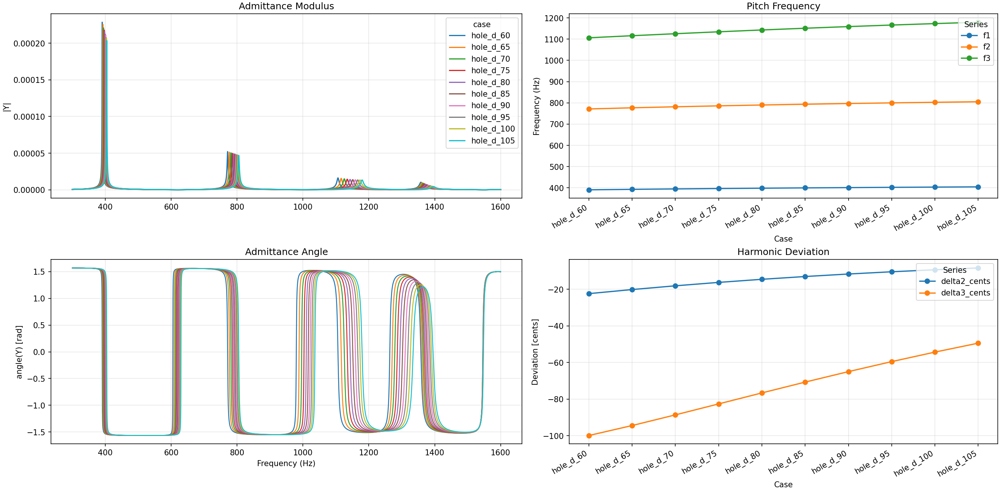
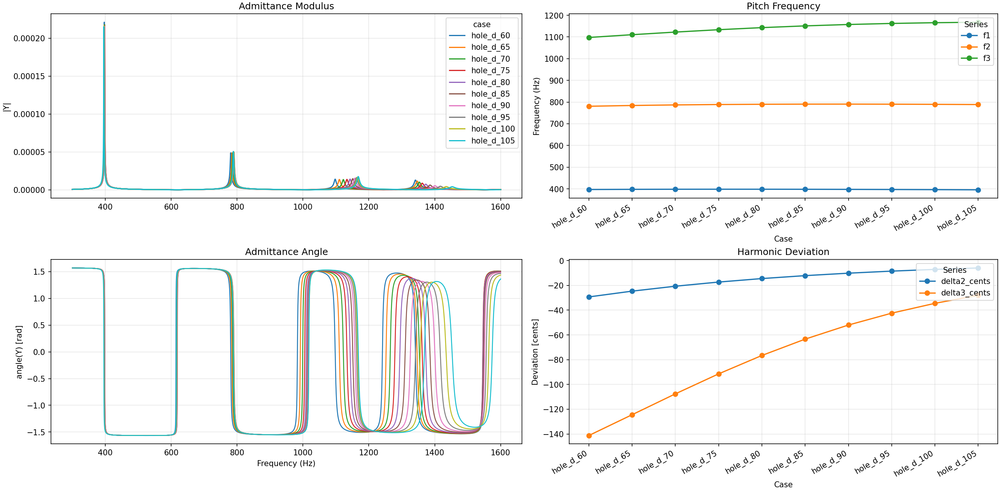

# OpenWind 实验记录（基础版）

## 目的

本文档用于记录当前仓库中几组基于 OpenWind / `openwind-batch-cli` 完成的频域实验，这些实验是笔者为解决自己设计的管乐器在高阶模态时的频率偏移问题而做，文档重点保存每次实验的：

- 实验背景
- 主要条件
- 输出图表对应关系
- 结果的客观描述

本文档尽量只记录可靠的实验上下文与直接观察结果，不在这里展开过多理论推导，方便后续自己回顾，也方便其他人在查看仓库时快速了解已完成的工作。该文档由ChatGPT整理。

---

## 通用说明

### 计算类型

这些实验均基于频域计算结果，主要查看以下四类输出：

1. **Admittance Modulus**
2. **Admittance Angle**
3. **Pitch Frequency**（记录提取出的 `f1`、`f2`、`f3`）
4. **Harmonic Deviation**（记录 `delta2_cents`、`delta3_cents`）

### 图中常用量

- `f1`：提取出的第一特征频率
- `f2`：提取出的第二特征频率
- `f3`：提取出的第三特征频率
- `delta2_cents`：`f2` 相对于理想 `2*f1` 的音分偏差
- `delta3_cents`：`f3` 相对于理想 `3*f1` 的音分偏差

### 关于图片路径

下面每一节都预留了图片插入位置。若将本文档与图片文件放在同一目录下，可直接使用相对路径。

---

# 实验 1：无音孔圆柱管——管长变化

## 背景

先从最简单的共鸣器开始：

- 无音孔
- 圆柱管
- 固定内径
- 只改变主管长度

目的：观察在最简单几何下，管长变化会如何影响 `f1/f2/f3` 及其相对理想倍频关系的偏差。

## 条件

- 无音孔
- 圆柱主管
- 内径固定为 **18 mm**
- 主管长度作为唯一变量
- 分析目标主要为 `delta2_cents`、`delta3_cents`

## 图像

### 图 1：管长变化实验结果

## 结果描述

- 随着主管长度增加，`f1`、`f2`、`f3` 均连续下降。
- `delta2_cents` 与 `delta3_cents` 均为正值。
- 随着主管长度增加，`delta2_cents` 与 `delta3_cents` 整体呈下降趋势。
- `delta3_cents` 的数值始终大于 `delta2_cents`。

---

# 实验 2：无音孔圆柱管——管径变化（主管长度不变）

## 背景

在主管长度保持不变的情况下，只改变无音孔圆柱管的内径，观察管径变化对频率及倍频偏差的影响。

## 条件

- 无音孔
- 圆柱主管
- 主管长度固定
- 内径由 **15.5 mm** 增加到 **20 mm**
- 其余参数保持不变

## 图像

### 图 2：无音孔圆柱管——管径变化（主管长度不变）

## 结果描述

- 随着内径增加，`f1`、`f2`、`f3` 均略有下降。
- `delta2_cents` 与 `delta3_cents` 均为正值。
- 随着内径增加，`delta2_cents` 与 `delta3_cents` 整体呈上升趋势。
- `delta3_cents` 的增幅明显大于 `delta2_cents`。
- 本组实验表明，在主管长度不变时，仅改变内径会明显改变倍频偏差。

---

# 实验 3：无音孔圆柱管——管径变化（同时补偿主管长度，使基频尽量保持一致）

## 背景

实验 2 中，管径变化会同时改变整体音高。为了进一步区分“整体音高变化”和“倍频结构变化”，本组实验在保持管径变化趋势的同时，对主管长度进行补偿，使各 case 的基频尽量保持一致。

## 条件

- 无音孔
- 圆柱主管
- 内径由 **15.5 mm** 增加到 **20 mm**
- 同时调整主管长度，使各 case 的 `f1` 尽量保持在相近范围
- 其余参数不变

## 图像

### 图 3：无音孔圆柱管——管径变化（补偿主管长度）

## 结果描述

- 补偿后，各 case 的 `f1` 基本保持一致。
- 尽管 `f1` 被控制在相近范围，`delta2_cents` 与 `delta3_cents` 仍然随内径增加而整体上升。
- `delta3_cents` 的变化幅度仍明显大于 `delta2_cents`。
- 这说明，在本组设置下，内径变化对倍频偏差的影响并不只是通过“整体音高变化”体现。

---

# 实验 4：带一个音孔——烟囱长度变化（音孔位置不补偿）

## 背景

在无音孔实验之后，加入一个音孔，研究音孔烟囱长度变化对频率和倍频偏差的影响。

本组实验中，目标基频设计在约 **400 Hz** 左右，以使其与前几组实验的基频量级接近，便于比较。

## 条件

- 设置一个音孔
- 其他参数保持不变
- 改变该音孔的烟囱长度
- 烟囱长度由 **1.0 mm** 增加到 **5.5 mm**
- 音孔位置不做额外补偿

## 图像

### 图 4：单音孔——烟囱长度变化（音孔位置不补偿）

## 结果描述

- 随着烟囱长度增加，`f1`、`f2`、`f3` 均整体下降。
- 与前几组无音孔实验不同，本组的 `delta2_cents` 与 `delta3_cents` 为负值。
- 随着烟囱长度增加，`delta2_cents` 与 `delta3_cents` 继续向更负的方向变化。
- `delta3_cents` 的绝对值明显大于 `delta2_cents`。
- 本组结果说明，在该设置下，通过开音孔获得目标基频时，倍频偏差方向与前几组无音孔实验不同。倍频与理想值的偏差程度和音孔的烟囱长度成正比。

---

# 实验 5：带一个音孔——烟囱长度变化（同时补偿音孔位置，使基频尽量保持一致）

## 背景

实验 4 中，烟囱长度变化会同时带来基频变化。为了区分“基频变化”和“倍频结构变化”，本组在保持烟囱长度变化趋势的同时，对音孔位置进行补偿，使各 case 的 `f1` 尽量保持一致。

## 条件

- 设置一个音孔
- 烟囱长度由 **1.0 mm** 增加到 **5.5 mm**
- 同时调整音孔位置，使各 case 的 `f1` 尽量保持在相近范围（约 400 Hz）
- 其余参数保持不变

## 图像

### 图 5：单音孔——烟囱长度变化（补偿音孔位置）

## 结果描述

- 补偿后，各 case 的 `f1` 基本保持一致。
- 即使在 `f1` 基本保持一致的情况下，`delta2_cents` 与 `delta3_cents` 仍然随着烟囱长度增加而继续向更负的方向变化。
- `delta3_cents` 的变化幅度仍明显大于 `delta2_cents`。
- 这表明，在本组设置下，烟囱长度变化对倍频偏差的影响并不只是通过基频变化体现。

---

# 实验 6：带一个音孔——音孔直径变化（音孔位置不补偿）

## 背景

在完成单音孔烟囱长度变化实验后，继续研究单音孔模型中“音孔直径”对频率和倍频偏差的影响。

本组实验保持其他参数不变，只改变音孔直径，观察 `f1`、`f2`、`f3` 以及 `delta2_cents`、`delta3_cents` 的变化趋势。

## 条件

- 单音孔模型
- 其余参数保持不变
- 音孔直径由 **6.0 mm** 增加到 **10.5 mm**
- 音孔位置不做额外补偿

## 图像

### 图 6：单音孔——音孔直径变化（音孔位置不补偿）

## 结果描述

- 随着音孔直径增加，f1 仅有小幅上升。
- f2 与 f3 也随音孔直径增加而上升，其中 f3 的变化更明显。
- delta2_cents 与 delta3_cents 均为负值。
- 随着音孔直径增加，delta2_cents 与 delta3_cents 持续向 0 靠近，即负偏差的绝对值逐步减小。
- elta3_cents 的变化幅度明显大于 delta2_cents。
- 本组结果表明，在该设置下，增大音孔直径会使倍频偏差减小，并使高阶频率更接近理想倍频关系。

---

# 实验 7：带一个音孔——音孔直径变化（同时补偿音孔位置，使基频尽量保持一致）

## 背景

实验 6 中，音孔直径变化会同时带来基频变化。为了进一步区分“基频变化”和“倍频结构变化”，本组在保持音孔直径变化趋势的同时，对音孔位置进行补偿，使各 case 的 f1 尽量保持一致。

## 条件

- 单音孔模型
- 音孔直径由 6.0 mm 增加到 10.5 mm
- 同时调整音孔位置，使各 case 的 f1 尽量保持在相近范围（约 400 Hz）
- 其余参数保持不变

## 图像

## 结果描述

- 补偿后，各 case 的 f1 基本保持一致。
- f2 的变化较小，f3 仍随音孔直径增加而明显上升。
- delta2_cents 与 delta3_cents 均为负值。
- 即使在 f1 基本保持一致的情况下，delta2_cents 与 delta3_cents 仍然随着音孔直径增加而持续向 0 靠近。
- delta3_cents 的变化幅度仍明显大于 delta2_cents。
- 这表明，在本组设置下，音孔直径变化对倍频偏差的影响并不只是通过基频变化体现；在基频被补偿后，这一趋势仍然存在。

---

# 当前已完成实验的小结（仅作目录性整理）

截至本文档编写时，已完成并记录的实验包括：

1. **无音孔圆柱管：主管长度变化**
2. **无音孔圆柱管：内径变化（主管长度不变）**
3. **无音孔圆柱管：内径变化（补偿主管长度）**
4. **单音孔：烟囱长度变化（音孔位置不补偿）**
5. **单音孔：烟囱长度变化（补偿音孔位置）**
6. **单音孔：音孔直径变化（音孔位置不补偿）**
7. **单音孔：音孔直径变化（补偿音孔位置）**

---

# 备注

如果后续继续增加实验，建议延续本文档结构：

- 背景
- 条件
- 图像
- 结果描述

并继续按图号顺序追加，以保持仓库内记录风格统一。
